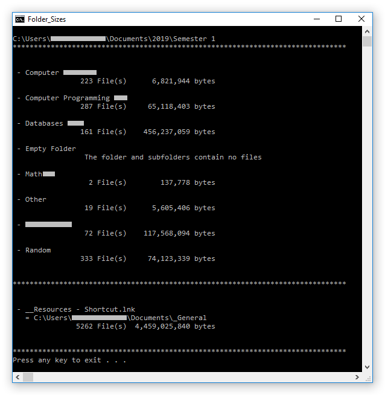

# FolderSizeList
One of my earliest projects: a batch program to list the sizes of folders within a directory

To install, place the .bat file in the desired directory, and run it. It will unpack some settings/log/script files into the current directory on the first run.  
If you run the program through a shortcut, make sure to clear the 'start in' field in the shortcut's properties.

To run, do any of the following:
 - Double click the batch file (or shortcut) to manually enter a path to a folder to examine
 - Drag a directory onto the batch file (or shortcut) to list the sizes of folders within that directory. Dragging a shortcut to a directory onto the file will have the same effect.
 - Drag multiple files/folders from the same parent directory onto the batch file (or shortcut) to list the sizes of all folders within that parent directory.

The sizes will be listed for both folders directly included in the examined directory and shortcuts to folders elsewhere.

Running the file directly (i.e. double clicking rather than dragging on a target folder) will allow access to a settings menu.

Previously examined directories will be logged in the install directory (in a folder called 'Previous Folders'), in HTML format, so that they can be accessed again quickly without having to wait for the program to scan the folders again (although it uses a 'DIR /A:-D /S' command rather than enumerating files manually or something, it's still time consuming for large folders).

Example use (redacted):

